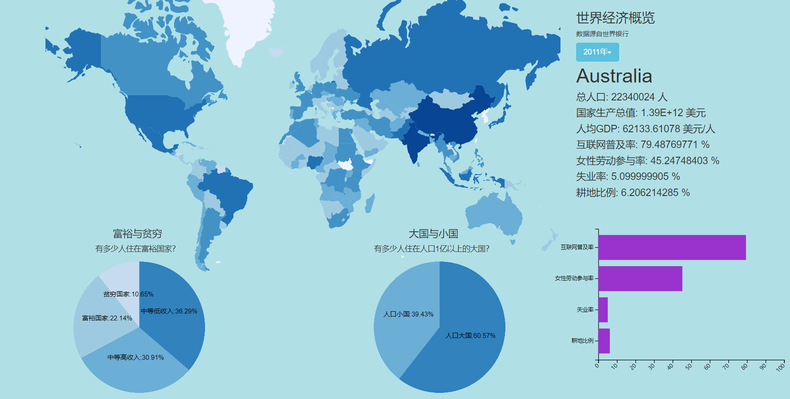

## 世界经济概览  说明文档

### 一、系统功能

​	使用D3.js作为前端框架，Flask作为后端框架

1. 实现全世界各国的基本经济数据展示

2. 实现总体富国、大国的分类及统计

3. 对每个国家的经济数据多维度描绘

4. 系统前后端分离，易于拓展维护

   

###二、页面分区

#### 世界地图

世界地图用于全球国家的选择，深度是人口密度。

当鼠标移动到该国上方，即触发展示该国当年的经济详情。

#### 全球经济研究区

此部分有两个图表，是全球经济按收入划分占比（饼图）与人口大国占比（饼图）

#####富裕与贫穷  global income pie

饼图（pie map）四部分分别代表高收入国家、中等偏上收入国家、中等偏下收入国家、低收入国家。

注：按照世界银行2015年的标准，人均GDP低于1045美元为低收入国家，在1045至4125美元之间为中等偏下收入国家，在4126至12735美元之间为中等偏上收入国家，高于12736美元为高收入国家。

##### 大国与小国 global population pie

饼图（pie map）两部分分别代表人口大国与人口小国。

注：按照一般标准，将人口大于一亿的国家视作人口大国，其余为人口小国。

####国家经济研究区

此部分有两个图表，主图是该国的经济详情（列表），附图是部分经济数据的柱状图。

#####国家经济详情 country detail

柱状图（bar chart）展示某国某年份的经济详细数据，对于每个国家，有6个参数

总人口、经济总量、人均GDP、失业率、可耕地比例、互联网普及率、女性劳动参与率

### 三、联动设计

#####国家经济研究区

鼠标移到世界地图某国家区域，右边的国家经济研究区会展示当年的该国数据。

#### 四、工程详情

####路由详情

| 路由名       | URL                                   | 请求方法 | 传入参数         | 返回参数            |
| ------------ | ------------------------------------- | -------- | ---------------- | ------------------- |
| 主页面       | /                                     | GET      |                  | 主页面html          |
| 国家清单     | /country_list                         | GET      |                  | 国家名清单          |
| 全球收入划分 | /global/income/<year>                 | GET      | 年份             | 全球X年国家收入划分 |
| 全球经济详情 | /global/detail/<year>/<xaxis>/<yaxis> | GET      | 年份，横轴，纵轴 | 全球X年分国家详情   |
| 国家发展进程 | /country/development/<country>        | GET      | 国家名           | 该国历年人均gdp     |
| 国家经济详情 | /country/detail/<year>/<country>      | GET      | 年份，国家名     | 该国X年6维详情      |

###目录结构

├── run.py
├── static
│   ├── bootstrap.css
│   ├── bootstrap.js
│   ├── countriesData.csv
│   ├── index.js
│   ├── jquery.js
│   └── style.css
└── templates
    └── index.html

### 五、测试结果

##### 测试流程

```
打开命令行
进入项目所在目录
>> python run.py
项目启动
打开浏览器
>> http://127.0.0.1:5000/
开始浏览
```

##### 页面显示



### 六、分析方法

1. 对数压缩：在进行经济数据统计时，有些参量区分太大（例如人均GDP，富国例如新加坡有9万美元，但穷国例如苏丹只有几百美元）。所以采取了对数压缩的方法，便于展示。
2. 多维展示：使用世界地图选择国家，对于每个国家使用了柱状图展示详情。对于全球的经济数据设计了人口、经济两个维度对国家分类。

### 七、发现与探究

#####可视化处理

1. 归一化处理：在使用热图时，要进行归一化处理，很多密度类的图形不能使用绝对化的值
2. 页面整合：所有图表应该合并在同一页面
3. 尺度压缩：最初在展现经济数据时，由于富国太富，导致人均GDP高的区域非常稀疏，此时我进行了“富裕指数”的尺度变换，对于人均GDP先对10取对数，再在最大与最小之间平均压缩到0~100。
4. 页面联动：使用世界地图选择国家

##### 工程优化

1. 前后端接口格式统一：后端预处理数据，统一以json格式传前端（$.getJSON(url, function)）。
2. 速度优化：项目启动时一次性读取数据作为全局变量，之后始终使用该变量响应，提升速度。
3. 数据预处理：使用pandas的df处理数据，用df[(df['attr']>100)]
4. 数据预处理：数据类型转换，.astype(np.int32)

#####问题及解决

1. 谷歌chrome的脚本内存问题：要在开发者工具disable掉脚本内存，否则不会加载新的JavaScript脚本。
2. div对齐问题：在排版时常常遇到div突然飞很远的问题，最后统一采用absolute绝对定位，将所有div固定。
3. 前期设计不足：前期设计不足，导致写代码时经常变化，耽误了很多时间，后来先画了一个原型，就好很多。

##### 有趣的发现

1. 按照世界银行的标准，生活在富裕国家的人口占全球比例是在逐年减少的。这个结果听起来很震惊，其实有原因。全球富裕国家的总数在几年内并没有很大变化，而富裕国家的人口普遍增长缓慢甚至减少（日本、韩国、法国），但穷国的人口却在快速增长（尼日利亚、孟加拉国）。所以尽管全世界经济都在增长，但富裕国家人口比例反而在减少。
2. 世界上耕地面积比例最高的是：印度，一半以上的国土都是耕地。耕地比例最低的是：阿曼，这是波斯湾一个沙漠国家，盛产石油。
3. 失业率高的地区都比较混乱，比如利比亚和伊拉克。但只有两个国家例外：西班牙失业率26%，希腊失业率27%，却是发达国家，都是坐吃山空的主。

